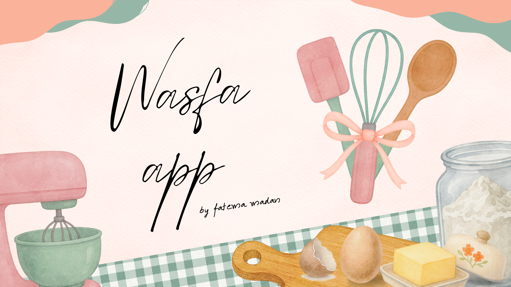

# 🍽️ Wasfa App



## 📖 Project Description

Wasfa App is a recipe manager built with Python, Streamlit, and Pandas. It helps users save, organize, and find their favorite recipes in one place. All recipes are stored in a CSV file, making them easy to manage.

---

## ❗ Problem Statement

Many people keep their recipes in different places like notebooks, paper, or phone apps. This makes it hard to find and manage recipes.

---

## 💡 Solution

Wasfa App gives users one place to store and manage recipes. Users can add new recipes, search by ingredient, view all recipes, and get a random recipe suggestion.

---

## ✨ Features

### Main Features

- Add a new recipe.
- Search recipes by ingredient.
- View all recipes.
- Get a random recipe.

### Extra Features

- Categorize recipes (Breakfast, Lunch, Dinner, Dessert).
- Rate recipes.
- Sort recipes by rating.
- Scale ingredients based on the number of servings.
- Create a shopping list.
- Save cooking history.

---

## 🛠️ Tools & Technologies

- Python
- Streamlit
- Pandas
- CSV File

---

## 📂 Project Structure

```text
wasfa_app/
│
├── Fatema_Recipe.py      # Main Streamlit application
├── helper.py             # Functions used by the application
├── recipes.csv           # Stores recipe data
├── history.txt           # Stores cooking history
├── images/
│   └── wasfa_app.png     # Project cover image
└── README.md             # Project documentation
```

---

## ⚙️ Installation

1. Clone the repository.

```bash
git clone https://github.com/fatema-madan/wasfa_app.git
```

2. Go to the project folder.

```bash
cd wasfa_app
```

3. Install the required libraries.

```bash
pip install streamlit pandas
```

4. Run the application.

```bash
streamlit run Fatema_Recipe.py
```

---

## 🚀 Live Application

[Open Wasfa App](https://wasfabh.streamlit.app/)

---

## 🎥 Project Presentation

[Watch Video Presentation](https://youtu.be/DYY7xLpdqCI?si=Si7BVF7hB8bnLbMt)

---

## 🚧 Challenges

- Making the ingredient scaling feature work correctly.
- Managing recipe data using a CSV file.
- Creating the shopping list.
- Saving cooking history.

---

## 🔮 Future Improvements

- Improve the ingredient scaling feature.
- Combine repeated ingredients in the shopping list.
- Let users edit and delete recipes.
- Add recipe images.
- Save data in a database instead of a CSV file.
